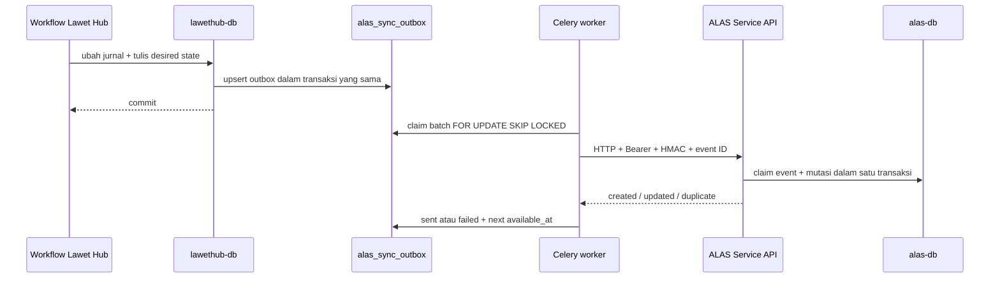

# Integrasi ALAS ↔ Lawet Hub

Dokumen ini adalah sumber kontrak kanonis integrasi runtime antara ALAS dan Lawet Hub. Lawet Hub adalah source of truth dan pemilik workflow; ALAS adalah read model untuk arsip publik serta dashboard visibilitas.

## Boundary antar-repository

Kedua aplikasi harus dapat di-clone, di-install, diuji, dibangun, dan di-deploy secara mandiri.

Integrasi yang diizinkan:

- HTTP melalui URL dari environment;
- bearer token dan HMAC secret yang diinjeksi saat runtime;
- payload JSON dengan kontrak eksplisit.

Integrasi yang dilarang:

- import source dari repository lain;
- dependency npm/Python pada package Lawet Hub atau ALAS;
- dependency `file:`, `link:`, path relatif/absolut ke repository lain;
- symlink/junction yang keluar dari root repository;
- Git submodule atau salinan source yang dijadikan dependency tersembunyi.

Aturan ini diperiksa oleh `scripts/check-repository-isolation.mjs` pada **masing-masing** repository. Checker lokal bukan shared package: tidak ada dependency build maupun test dari ALAS ke checkout Lawet Hub, atau sebaliknya.

## Dua channel integrasi

| Channel | Arah | Tujuan | Boundary |
| --- | --- | --- | --- |
| Direct Service | Lawet Hub → ALAS | Mengubah proyeksi jurnal/pimpinan | Bearer + HMAC + event ID; dikirim dari outbox |
| Dashboard visibility | ALAS → Lawet Hub | Login dan membaca workflow/media terlindungi | JWT scope `alas:dashboard:read`; read-only |

Keduanya memakai credential berbeda. JWT pengguna dashboard tidak boleh dipakai untuk Direct Service, dan service token tidak boleh dipakai sebagai sesi pengguna.

## Direct Service: delivery flow



### Transactional outbox

Lawet Hub tidak menganggap proyeksi ALAS tersinkron saat transaksi authoring selesai. Transaksi tersebut hanya menyimpan desired state ke `alas_sync_outbox` bersama perubahan jurnal.

- Satu row aktif per `jurnal_id` dikuatkan oleh unique constraint.
- Enqueue berikutnya melakukan atomic upsert dan mengganti desired state lama dengan event ID baru.
- Worker mengambil row `pending`/`failed` yang sudah jatuh tempo menggunakan `FOR UPDATE SKIP LOCKED`.
- Keberhasilan mengubah status menjadi `sent` dan memperbarui `last_synced_at`.
- Kegagalan menyimpan jenis error yang aman, menaikkan `attempts`, lalu menjadwalkan exponential backoff.
- Timeout, base delay, maksimum delay, batch size, dan poll interval seluruhnya berasal dari environment.

### Reconciliation

Task `reconcile_alas` berjalan berkala dan mengubah state jurnal yang seharusnya terlihat/tidak terlihat menjadi desired operation baru:

- `published` atau `publish_pending` → `upsert`;
- `deleted` → `delete`;
- `unpublish_pending`, atau draft yang pernah memiliki `alas_jurnal_id` → `unpublish`.

Re-run aman karena enqueue melakukan upsert satu row per jurnal. Delivery tetap aman saat retry karena ALAS memproses event ID secara idempoten.

## Autentikasi write request

Semua endpoint `/api/service/*` membutuhkan:

```http
Authorization: Bearer <ALAS_SERVICE_TOKEN>
```

Operasi `POST`, `PATCH`, dan `DELETE` juga wajib membawa:

```http
X-ALAS-Event-Id: <UUID>
X-ALAS-Timestamp: <Unix timestamp seconds>
X-ALAS-Signature: <hex HMAC-SHA256>
Content-Type: application/json
```

Canonical signing string adalah:

```text
<timestamp>\n<METHOD_UPPERCASE>\n<pathname>\n<SHA256_HEX(raw_body)>
```

`pathname` tidak menyertakan origin atau query string. Untuk `DELETE`, raw body kosong dan hash body tetap SHA-256 dari byte kosong. Lawet Hub menandatangani **byte JSON persis** yang dikirim.

ALAS memverifikasi:

1. bearer token memakai constant-time comparison;
2. timestamp dan signature tersedia;
3. usia timestamp tidak melewati `ALAS_REPLAY_WINDOW_SECONDS`;
4. signature HMAC-SHA256 valid;
5. event ID adalah UUID valid.

Konfigurasi yang hilang atau invalid menyebabkan request gagal tertutup, bukan memakai secret atau replay window bawaan tersembunyi.

## Idempotency dan transaction boundary

ALAS menyimpan setiap `X-ALAS-Event-Id` di tabel `service_events`. Insert ledger memakai `ON CONFLICT DO NOTHING`; bila event sudah ada, endpoint mengembalikan `action: "duplicate"` tanpa mengulang mutasi.

Claim event dan perubahan jurnal/pimpinan berada dalam transaksi database yang sama. Jika handler gagal, claim ikut rollback sehingga delivery yang sama dapat dicoba kembali. `source_id` unik menjadi identity lintas sistem dan upsert create/update dilakukan atomik.

Semantik delete bersifat soft state:

- jurnal: `is_published=false`;
- pimpinan: `is_active=false`.

## Endpoint Direct Service

### Jurnal

| Method | Path | Kontrak |
| --- | --- | --- |
| `POST` | `/api/service/jurnal` | Upsert full payload berdasarkan `source_id`. |
| `GET` | `/api/service/jurnal` | List; filter `page`, `limit`, `divisi`, `search`, `start_date`, `end_date`, `sort`. |
| `GET` | `/api/service/jurnal/:sourceId` | Detail proyeksi berdasarkan source ID. |
| `PATCH` | `/api/service/jurnal/:sourceId` | Partial update; mendukung `is_published`. |
| `DELETE` | `/api/service/jurnal/:sourceId` | Unpublish proyeksi. |
| `PATCH` | `/api/service/jurnal/:sourceId/dokumen` | Ganti daftar lampiran beserta `is_public`. |

Payload create jurnal bersifat strict dan divalidasi Zod:

```json
{
  "source_id": "UUID Lawet Hub",
  "judul": "string",
  "tanggal_kegiatan": "YYYY-MM-DD",
  "kategori": "string",
  "link_publikasi": null,
  "dokumentasi": [],
  "dokumen_pendukung": [],
  "pihak_terkait": [],
  "custom_fields": [],
  "tags": [],
  "redaksi": null,
  "divisi": null
}
```

`dokumen_pendukung` dari full sync hanya menerima `nama`, `url`, dan `tipe`; ALAS mempertahankan nilai `is_public` yang sudah ditetapkan untuk URL yang sama. Endpoint khusus `/dokumen` menerima `is_public` untuk mengubah visibility.

### Pimpinan

| Method | Path | Kontrak |
| --- | --- | --- |
| `POST` | `/api/service/pimpinan` | Upsert full payload berdasarkan `source_id`. |
| `GET` | `/api/service/pimpinan` | List pimpinan. |
| `GET` | `/api/service/pimpinan/:sourceId` | Detail pimpinan. |
| `PATCH` | `/api/service/pimpinan/:sourceId` | Partial update; mendukung `is_active`. |
| `DELETE` | `/api/service/pimpinan/:sourceId` | Menonaktifkan pimpinan. |

Payload create pimpinan:

```json
{
  "source_id": "UUID Lawet Hub",
  "nama": "string",
  "jabatan": "string",
  "foto_url": null,
  "bio": null,
  "periode_mulai": "YYYY-MM-DD",
  "periode_selesai": null,
  "urutan": 0
}
```

Schema executable adalah sumber terakhir untuk field dan limit: `src/features/jurnal-sync/model/service-payload.ts` di ALAS dan `build_alas_payload` di Lawet Hub. Perubahan kontrak harus memperbarui producer, consumer, test kontrak, dan dokumen ini dalam perubahan yang sama.

## Respons dan error handling

| Status | Makna |
| --- | --- |
| `200` | Update, delete/unpublish, read, atau duplicate event berhasil. |
| `201` | Proyeksi baru dibuat. |
| `401` | Bearer atau HMAC tidak valid, timestamp kedaluwarsa, atau konfigurasi auth tidak tersedia. |
| `404` | `source_id` tidak ditemukan untuk operasi target. |
| `422` | Event ID atau payload tidak valid. |
| `500` | Kegagalan internal; body tidak membocorkan detail exception. |

HTTP non-2xx dan timeout membuat outbox berstatus `failed`. Worker tidak melakukan retry inline yang panjang; row dijadwalkan ulang menggunakan exponential backoff sehingga partial failure tidak menggagalkan transaksi authoring Lawet Hub.

## Dashboard visibility: ALAS → Lawet Hub

ALAS memakai `LAWET_API_URL` hanya pada server. Login mengirim header:

```http
X-Lawet-Client: alas-dashboard
```

Lawet Hub kemudian menerbitkan access token dengan scope `alas:dashboard:read` tanpa refresh token. Dependency auth Lawet Hub menolak token tersebut untuk semua method selain `GET`, `HEAD`, dan `OPTIONS`.

Endpoint visibility yang dipakai ALAS:

| Method | Endpoint Lawet Hub | Tujuan |
| --- | --- | --- |
| `POST` | `/api/v1/auth/login` | Autentikasi awal; belum memakai dashboard JWT. |
| `GET` | `/api/v1/auth/me` | Identitas dan role pengguna. |
| `GET` | `/api/v1/jurnal-alas/draft?limit=50` | Daftar draft yang boleh dilihat. |
| `GET` | `/api/v1/jurnal-alas/approval-queue` | Antrean approval. |
| `GET` | `/api/v1/jurnal-alas/approval-queue/:id` | Detail item approval. |
| `GET` | `/api/v1/jurnal-alas/media/:prefix/:path` | Media terlindungi melalui proxy ALAS. |

Proxy media ALAS hanya menerima prefix `jurnal-foto` atau `jurnal-dokumen`, menolak segmen path berbahaya, menerapkan `LAWET_REQUEST_TIMEOUT_MS`, dan selalu mengirim `Cache-Control: private, no-store`.

Submit, upload, approve, dan reject tidak diteruskan oleh ALAS. Action legacy gagal tertutup tanpa network call dan UI mengarahkan pengguna ke `LAWET_PUBLIC_URL` untuk menyelesaikan workflow tulis.

## Konfigurasi

### ALAS

| Variable | Wajib | Fungsi |
| --- | --- | --- |
| `ALAS_SERVICE_TOKEN` | Ya untuk Service API | Verifikasi bearer Direct Service. |
| `ALAS_WEBHOOK_SECRET` | Ya untuk write | Verifikasi HMAC; harus berbeda dari bearer token. |
| `ALAS_REPLAY_WINDOW_SECONDS` | Ya untuk write | Replay window dalam detik. |
| `LAWET_API_URL` | Ya untuk dashboard | Origin internal Lawet Hub. |
| `LAWET_PUBLIC_URL` | Ya untuk link workflow | Origin yang dapat dibuka browser. |
| `LAWET_REQUEST_TIMEOUT_MS` | Ya untuk proxy media | Timeout request media. |

### Lawet Hub

| Variable | Wajib | Fungsi |
| --- | --- | --- |
| `ALAS_API_URL` | Ya | Origin ALAS tanpa suffix `/api`; normalizer menerima suffix itu bila terlanjur ada. |
| `ALAS_SERVICE_TOKEN` | Ya | Nilai yang sama dengan verifier ALAS. |
| `ALAS_WEBHOOK_SECRET` | Ya untuk write | Nilai HMAC yang sama dengan ALAS. |
| `ALAS_SYNC_TIMEOUT_SECONDS` | Ya | Timeout HTTP delivery. |
| `ALAS_SYNC_RETRY_BASE_SECONDS` | Ya | Delay retry awal. |
| `ALAS_SYNC_RETRY_MAX_SECONDS` | Ya | Batas exponential backoff. |
| `ALAS_SYNC_BATCH_SIZE` | Ya | Maksimum row per batch worker. |
| `ALAS_SYNC_POLL_SECONDS` | Ya | Interval polling outbox. |
| `ALAS_RECONCILIATION_SECONDS` | Ya | Interval reconciliation desired state. |

Gunakan secret acak yang berbeda untuk bearer dan HMAC. Rotasi harus dikoordinasikan karena saat ini masing-masing pihak membaca satu nilai aktif.

## Verifikasi perubahan integrasi

Di repository ALAS:

```bash
npm run boundary:test
npm run arch:check
npx vitest run tests/service_auth.test.ts tests/service_delivery.test.ts tests/lawet_dashboard_boundary.test.ts
```

Di repository Lawet Hub:

```bash
make lint-arch
cd backend && pytest tests/test_jurnal_alas_outbox.py tests/test_tasks_alas.py tests/test_alas_dashboard_scope.py
```

Perubahan migrasi outbox juga harus menjalankan `backend/tests/test_alas_outbox_migration.py` dengan Docker/Testcontainers tersedia.

## Keputusan arsitektur

- [ADR-0001 — Direct Service delivery guarantees](docs/adr/0001-direct-service-delivery-guarantees.md)
- [ADR-0002 — Dashboard JWT read boundary](docs/adr/0002-dashboard-jwt-read-boundary.md)
- [ADR-0003 — FSD App Router boundaries](docs/adr/0003-fsd-app-router-boundaries.md)

ADR yang sudah diterima tidak diedit. Keputusan struktural baru harus ditulis sebagai ADR baru.
