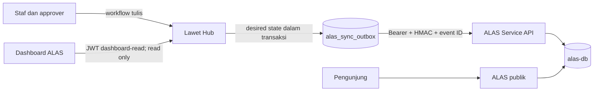

# ALAS — Arsip Langkah Bawaslu Kebumen

ALAS adalah portal arsip publik dan dashboard visibilitas **read-only** untuk kegiatan serta pimpinan Bawaslu Kebumen. Lawet Hub tetap menjadi source of truth dan satu-satunya tempat workflow authoring; ALAS menyimpan proyeksi publiknya sendiri di PostgreSQL.

## Status arsitektur

- Lawet Hub mengirim desired state melalui transactional outbox ke Direct Service API ALAS.
- Operasi tulis Service API memakai bearer token, HMAC-SHA256, replay window, dan event ID idempoten.
- Sesi dashboard ALAS memperoleh JWT Lawet Hub dengan scope `alas:dashboard:read`; token tersebut hanya boleh memakai `GET`, `HEAD`, dan `OPTIONS`.
- ALAS dan Lawet Hub adalah repository mandiri. Keduanya berkomunikasi melalui HTTP dan konfigurasi environment, tanpa import source, package dependency, file link, symlink, atau submodule silang.
- Next.js App Router disusun dengan adaptasi Feature-Sliced Design (FSD) dan dependency direction diperiksa di CI.



## Dokumentasi utama

| Dokumen | Isi |
| --- | --- |
| [Integrasi Lawet Hub](INTEGRATION.md) | Kontrak HTTP, autentikasi, idempotency, retry, reconciliation, dan konfigurasi dua aplikasi. |
| [Arsitektur](docs/architecture/ARCHITECTURE.md) | Batas sistem, alur data, FSD, dan quality gates. |
| [Testing](docs/architecture/TESTING.md) | Lapisan test dan perintah verifikasi. |
| [ERD](docs/architecture/ERD.md) | Struktur data ALAS. |
| [Runbook](docs/ops/RUNBOOK.md) | Operasi dan deployment. |
| [ADR](docs/adr/) | Keputusan arsitektur yang telah diterima; ADR bersifat immutable. |

## Tech stack

| Area | Teknologi |
| --- | --- |
| Web | Next.js 14, React 18, App Router |
| Data | PostgreSQL 16, Drizzle ORM |
| UI | Tailwind CSS, D3.js, TanStack Query |
| Validasi dan test | Zod, Vitest, React Testing Library, Testcontainers |
| Infrastruktur | Docker Compose, Nginx |

## Struktur repository

```text
src/
├── app/        # route, layout, dan komposisi App Router
├── views/      # komposisi tingkat halaman
├── widgets/    # blok UI lintas feature/entity
├── features/   # use case dan interaksi pengguna
├── entities/   # model domain, API, dan UI entitas
└── shared/     # infrastruktur dan UI tanpa pengetahuan domain
drizzle/        # schema dan migration Drizzle
tests/          # test Vitest dan integration test
scripts/        # repository/architecture checks
docs/           # architecture, ADR, product, ops, dan audit
```

Arah dependency yang diizinkan adalah `app → views → widgets → features → entities → shared`. Client component memakai suffix `.client.tsx`. Public barrel `index.ts` ditempatkan hanya pada slice `entities` atau `shared`; enforcement public API saat ini sudah aktif untuk `entities/lawet-user` dan diperluas secara bertahap ke entity lain.

Jalankan gate arsitektur sebelum mengirim perubahan:

```bash
npm run boundary:test
npm run arch:check
```

`boundary:check` menolak dependency ke repository Lawet Hub, termasuk import eksternal, package yang dilarang, `file:`/`link:` dependency, symlink keluar repository, dan Git submodule. `arch:check` menjalankan pemeriksaan tersebut lalu dependency-cruiser untuk aturan FSD.

## Menjalankan secara lokal

Prasyarat: Node.js 20+, npm, Docker, dan Docker Compose.

```bash
npm ci
docker compose -f docker-compose.alas.yml up -d alas-db
```

Salin konfigurasi dan sesuaikan koneksi database. Saat aplikasi dijalankan dari host, gunakan port database yang dipublikasikan Compose:

```bash
cp .env.example .env
# DATABASE_URL=postgresql://alas_user:<password>@localhost:5433/alas
npx drizzle-kit migrate
npm run dev
```

Aplikasi development tersedia di `http://localhost:3000`. Untuk menjalankan seluruh stack Compose:

```bash
docker compose -f docker-compose.alas.yml up -d --build
```

Reverse proxy ALAS pada konfigurasi tersebut tersedia di `http://localhost:2006`.

## Environment variables

Salin `.env.example`; jangan commit nilai rahasia.

| Variable | Pemilik/tujuan |
| --- | --- |
| `DATABASE_URL` | Koneksi PostgreSQL ALAS. |
| `ALAS_DB_NAME`, `ALAS_DB_USER`, `ALAS_DB_PASSWORD` | Bootstrap container database. |
| `ALAS_SERVICE_TOKEN` | Bearer token Direct Service; nilainya harus sama di Lawet Hub. |
| `ALAS_WEBHOOK_SECRET` | Secret HMAC write request; berbeda dari service token dan sama di Lawet Hub. |
| `ALAS_REPLAY_WINDOW_SECONDS` | Batas usia timestamp signature; wajib bilangan bulat positif. |
| `LAWET_API_URL` | Origin Lawet Hub internal, hanya untuk server ALAS. |
| `LAWET_PUBLIC_URL` | Origin Lawet Hub yang dapat dibuka browser untuk workflow tulis. |
| `LAWET_REQUEST_TIMEOUT_MS` | Timeout proxy media Lawet Hub. |
| `ALAS_ADMIN_ROLE_LEVEL` | Level role minimum untuk pengaturan situs ALAS. |
| `SENTRY_DSN`, `NEXT_PUBLIC_SENTRY_DSN` | Observability opsional. |

`ALAS_SERVICE_TOKEN` dan `ALAS_WEBHOOK_SECRET` adalah dua secret terpisah. ALAS tidak memerlukan credential write ke database atau MinIO Lawet Hub.

## API ringkas

### API publik

| Method dan path | Fungsi |
| --- | --- |
| `GET /api/jurnal` | Daftar jurnal; mendukung `q`, `kategori`, `date`, `cursor`, dan `limit`. |
| `GET /api/jurnal/:id` | Detail jurnal publik dan lampiran yang diizinkan. |
| `GET /api/jurnal/calendar?month=YYYY-MM` | Tanggal yang memiliki kegiatan. |
| `GET /api/jurnal/stats?year=YYYY` | Statistik jurnal. |
| `GET /api/jurnal/kategori` | Daftar kategori. |
| `GET /api/pimpinan?date=YYYY-MM-DD` | Pimpinan aktif pada tanggal tertentu. |
| `GET /api/pimpinan/:id` | Detail pimpinan. |
| `GET /api/health` | Health check aplikasi dan database. |

### Direct Service API

| Method dan path | Fungsi |
| --- | --- |
| `POST /api/service/jurnal` | Upsert proyeksi jurnal berdasarkan `source_id`. |
| `GET /api/service/jurnal` | List proyeksi untuk operasi/reconciliation. |
| `GET /api/service/jurnal/:sourceId` | Baca satu proyeksi. |
| `PATCH /api/service/jurnal/:sourceId` | Perbarui atau unpublish proyeksi. |
| `DELETE /api/service/jurnal/:sourceId` | Soft-delete dengan `is_published=false`. |
| `PATCH /api/service/jurnal/:sourceId/dokumen` | Perbarui visibilitas lampiran. |
| `POST /api/service/pimpinan` | Upsert pimpinan berdasarkan `source_id`. |
| `GET /api/service/pimpinan[/:sourceId]` | List atau detail pimpinan. |
| `PATCH /api/service/pimpinan/:sourceId` | Perbarui pimpinan. |
| `DELETE /api/service/pimpinan/:sourceId` | Nonaktifkan pimpinan. |

Semua endpoint service membutuhkan bearer token. `POST`, `PATCH`, dan `DELETE` juga membutuhkan `X-ALAS-Event-Id`, `X-ALAS-Timestamp`, serta `X-ALAS-Signature`. Detail payload dan canonical signing string ada di [INTEGRATION.md](INTEGRATION.md).

## Security dan data integrity

- `source_id` unik menjaga satu proyeksi per record Lawet Hub.
- `service_events.event_id` menjadi idempotency ledger; claim event dan mutasi domain terjadi dalam satu transaksi.
- HMAC memverifikasi timestamp, method, pathname, dan SHA-256 body; perbandingan signature menggunakan constant-time comparison.
- Reconciliation Lawet Hub mengantrekan ulang desired state secara idempoten dan outbox memakai row locking `SKIP LOCKED` saat delivery.
- Dashboard token tidak memiliki refresh token dan ditolak pada method mutasi oleh Lawet Hub.
- Media terlindungi diproksi server-side, dibatasi prefix, memakai timeout, dan selalu `Cache-Control: private, no-store`.
- Workflow submit, upload, approve, dan reject tidak dijalankan oleh ALAS; pengguna diarahkan ke Lawet Hub.

## Pengujian dan quality gates

```bash
npm run boundary:test
npm run arch:check
npm run test:unit
npm run test:integration
npm run lint
npm run build
```

`npm test` menjalankan seluruh suite. Gunakan `test:unit` untuk pemeriksaan cepat tanpa database dan `test:integration` untuk endpoint/data yang membutuhkan PostgreSQL lokal atau Docker. `TEST_DATABASE_URL` dapat dipakai untuk mengganti koneksi test default. Lihat [Testing Architecture](docs/architecture/TESTING.md) untuk pemilihan suite.

## Deployment

Gunakan `docker-compose.prod.yml`, secret produksi dari environment, koneksi PostgreSQL TLS untuk database eksternal, dan jalankan migrasi sebelum aplikasi menerima traffic. Checklist deploy, health check, backup, serta rollback berada di [Runbook](docs/ops/RUNBOOK.md).
