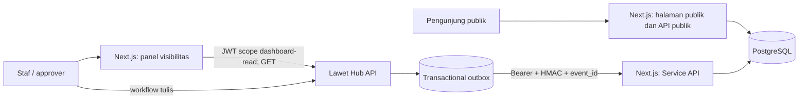

# Arsitektur ALAS

ALAS adalah aplikasi Next.js 14 dengan App Router yang memisahkan pengalaman arsip publik, panel visibilitas terautentikasi, API publik, dan Service API integrasi. PostgreSQL adalah penyimpanan lokal untuk data arsip yang diterbitkan.

## Batas Sistem

| Area | Lokasi | Tanggung jawab |
| --- | --- | --- |
| Routing dan endpoint | `src/app/` | Page App Router, route handler, dan layout panel. |
| Tampilan halaman | `src/views/`, `src/widgets/` | Susunan UI tingkat halaman dan komposisi multi-entitas. |
| Fitur | `src/features/` | Filter jurnal, autentikasi dan visibilitas Lawet Hub, serta sinkronisasi Service API. |
| Entitas | `src/entities/` | Query, model, dan UI untuk `jurnal` serta `pimpinan`. |
| Shared | `src/shared/` | Koneksi basis data dan komponen yang dipakai lintas area. |
| Persistensi | `drizzle/` | Skema Drizzle, migrasi, dan seed data. |

Alias TypeScript `@/*` menunjuk ke `src/*`. Ketergantungan diarahkan dari page/widget/feature ke entity dan shared; shared tidak boleh bergantung pada feature.

## Alur Data

### Arsip publik

Halaman `/` menggunakan `LandingView`, yang membaca endpoint publik. Route handler publik hanya mengembalikan jurnal yang layak tampil, menyaring lampiran berdasarkan `is_public`, dan mengubah foto gambar pertama menjadi `thumbnail_url`.

Endpoint publik yang tersedia:

| Endpoint | Fungsi |
| --- | --- |
| `GET /api/jurnal` | Daftar jurnal dengan pencarian, kategori, tanggal, dan cursor pagination. |
| `GET /api/jurnal/:id` | Detail jurnal publik. |
| `GET /api/jurnal/calendar?month=YYYY-MM` | Tanggal yang memiliki kegiatan. |
| `GET /api/jurnal/stats?year=YYYY` | Rekap kategori dan tahun yang tersedia. |
| `GET /api/jurnal/kategori` | Daftar kategori jurnal. |
| `GET /api/pimpinan?date=YYYY-MM-DD` | Pimpinan aktif untuk suatu tanggal. |
| `GET /api/pimpinan/:id` | Detail pimpinan. |
| `GET /api/health` | Pemeriksaan koneksi database dan uptime proses. |

### Visibilitas workflow

Layout grup rute historis `(authoring)` memanggil `getMeAction`. Token Lawet Hub disimpan sebagai cookie HTTP-only bernama `lawet_token` dan diterbitkan dengan scope `alas:dashboard:read`; Lawet Hub menolak token itu pada seluruh method mutasi. Pengunjung tanpa sesi dialihkan ke `/login`; halaman `/approval` hanya muncul bagi peran dengan `level >= 2`.

ALAS dapat menampilkan jurnal pengguna, antrean, detail, dan media terlindungi. Pembuatan jurnal, upload, approval, dan rejection dilakukan di Lawet Hub; kontrol ALAS mengarah ke `LAWET_PUBLIC_URL`. Keputusan security boundary lengkap ada di [ADR-0002](../adr/0002-dashboard-jwt-read-boundary.md).

### Service API

Route di `src/app/api/service/` menerima bearer service token. Semua operasi tulis juga wajib membawa `X-ALAS-Event-Id`, `X-ALAS-Timestamp`, dan `X-ALAS-Signature`. Signature HMAC-SHA256 meliputi timestamp, method, path, dan hash body; replay dibatasi oleh `ALAS_REPLAY_WINDOW_SECONDS`. Event diklaim dalam transaksi yang sama dengan mutasi, sehingga retry outbox tidak menerapkan event dua kali. Upsert jurnal/pimpinan memakai `source_id` unik dan `ON CONFLICT` atomik.

Lawet Hub mencatat desired state ke transactional outbox. Worker mengirimnya dengan timeout serta exponential backoff dari env, dan reconciliation berkala mengantrekan ulang proyeksi yang seharusnya published, draft setelah unpublish, atau deleted. Keputusan lengkap ada di [ADR-0001](../adr/0001-direct-service-delivery-guarantees.md).

Kontrak payload dan status respons Service API historis masih dapat ditemukan di README root. Saat kontrak berubah, perbarui dokumen ini dan dokumentasi integrasi dalam perubahan yang sama.

## Konfigurasi dan Infrastruktur

- `DATABASE_URL` menghubungkan aplikasi ke PostgreSQL.
- `ALAS_SERVICE_TOKEN` mengamankan Service API dan harus sama dengan konfigurasi pengirim di Lawet Hub.
- `ALAS_WEBHOOK_SECRET` menandatangani write Direct Service dan harus berbeda dari bearer token.
- `ALAS_REPLAY_WINDOW_SECONDS` menentukan toleransi usia timestamp signature.
- `LAWET_API_URL` hanya dipakai server-side untuk login dan pembacaan visibilitas Lawet Hub.
- `LAWET_PUBLIC_URL` adalah origin Lawet Hub yang dapat dibuka browser untuk workflow tulis.
- `LAWET_REQUEST_TIMEOUT_MS` membatasi waktu tunggu proxy media terlindungi.
- Docker Compose menjalankan `alas-db`, `alas-app`, dan `alas-nginx` pada jaringan `alas-net`; Nginx adalah reverse proxy untuk aplikasi Next.js.

Panduan operasional ada di [RUNBOOK.md](../ops/RUNBOOK.md), sedangkan struktur data di [ERD.md](ERD.md).
