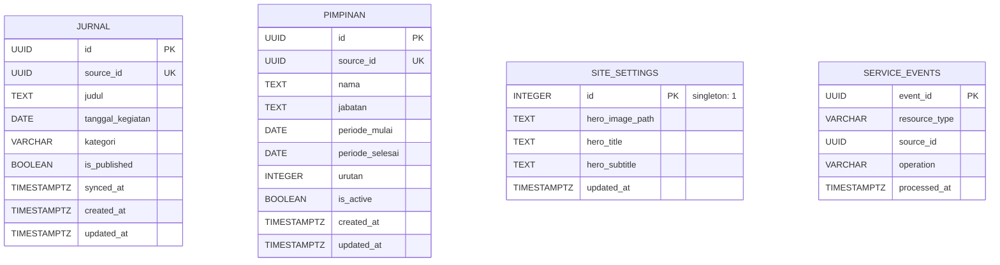

# Entity-Relationship Diagram ALAS

ALAS menyimpan dua entitas utama. Keduanya menerima `source_id` unik dari Lawet Hub agar operasi sinkronisasi dapat bersifat idempoten.

## Jurnal

Selain kolom inti pada diagram, `jurnal` menyimpan `link_publikasi`, `redaksi`, dan `divisi`. Struktur berulang disimpan sebagai JSONB: `dokumentasi`, `dokumen_pendukung`, `pihak_terkait`, `custom_fields`, dan `tags`.

`is_published` adalah batas visibilitas jurnal. Operasi hapus dari Service API melakukan soft delete dengan menyetelnya menjadi `false`, sehingga record masih dapat diaudit dan disinkronkan ulang.

## Pimpinan

`pimpinan` juga menyimpan `foto_url` dan `bio`. Endpoint publik hanya mengembalikan data dengan `is_active = true` dan menggunakan rentang periode untuk memilih pimpinan pada tanggal yang diminta.

## Site settings

`site_settings` adalah record singleton (`id = 1`) untuk konfigurasi visual yang dikelola admin. Admin dapat mengubah `hero_title` dan `hero_subtitle`; beranda memakai `ALAS` dan `Arsip Langkah Bawaslu Kebumen` apabila nilainya belum ada. Saat gambar hero diperbarui, aplikasi menyimpan path aset WebP di tabel ini; file hasil konversi berada di volume `public/uploads/hero` yang persisten. Beranda memakai fallback `public/assets/banner-image.webp` apabila record belum ada.

Indeks parsial pada `jurnal` mempercepat pagination publik berdasarkan tanggal, dan filter kategori yang hanya membaca record `is_published = true`. Indeks GIN pada `tags` disediakan untuk pencarian tag JSONB.

## Service event ledger

`service_events` adalah ledger idempotency untuk write Direct Service. Insert event dan mutasi proyeksi berada dalam satu transaksi; primary key `event_id` mencegah retry outbox menerapkan event yang sama dua kali. Indeks `(resource_type, source_id)` mendukung audit delivery per agregat.

## Migrasi

Skema kanonis berada di `drizzle/schema.ts`; perubahan struktur wajib melalui file baru di `drizzle/migrations/`. Jangan mengubah migrasi yang telah diterapkan. Prosedur eksekusi ada di [RUNBOOK.md](../ops/RUNBOOK.md).
