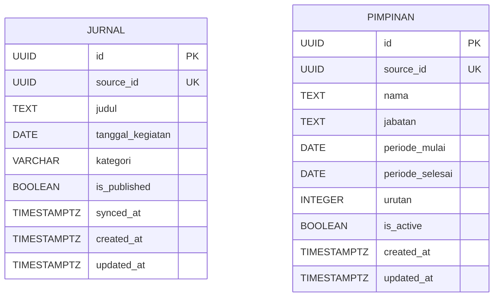

# Entity-Relationship Diagram ALAS

ALAS menyimpan dua entitas utama. Keduanya menerima `source_id` unik dari Lawet Hub agar operasi sinkronisasi dapat bersifat idempoten.

## Jurnal

Selain kolom inti pada diagram, `jurnal` menyimpan `link_publikasi`, `redaksi`, dan `divisi`. Struktur berulang disimpan sebagai JSONB: `dokumentasi`, `dokumen_pendukung`, `pihak_terkait`, `custom_fields`, dan `tags`.

`is_published` adalah batas visibilitas jurnal. Operasi hapus dari Service API melakukan soft delete dengan menyetelnya menjadi `false`, sehingga record masih dapat diaudit dan disinkronkan ulang.

## Pimpinan

`pimpinan` juga menyimpan `foto_url` dan `bio`. Endpoint publik hanya mengembalikan data dengan `is_active = true` dan menggunakan rentang periode untuk memilih pimpinan pada tanggal yang diminta.

## Migrasi

Skema kanonis berada di `drizzle/schema.ts`; perubahan struktur wajib melalui file baru di `drizzle/migrations/`. Jangan mengubah migrasi yang telah diterapkan. Prosedur eksekusi ada di [RUNBOOK.md](../ops/RUNBOOK.md).
